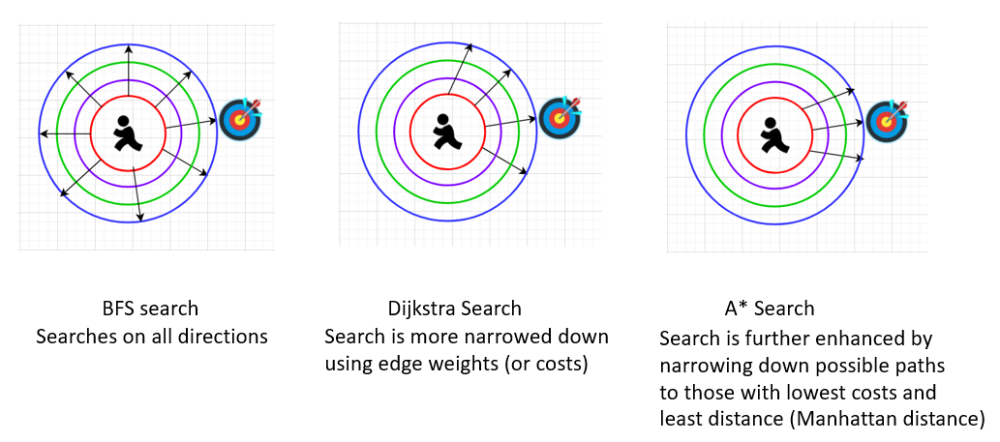

# Algorithms
 Implementing the following algorithms using [Networkx library](https://networkx.org/).
 
 In a way, these three algorithm seems to be extension of each other. While BFS, will search the grid in all directions, Dijkstra takes the edge weight also into account. AStar, gets even more specific and not only takes the edge weight (or cost), it also measures the manhatan distance ( using two nodes of each edge).
 1. [BFS](BreadthFirstSearch.ipynb) 
 2. [Dijkstra Algorithm](DijkstraAlgorithm.ipynb)
 3. [AStar](AStar.ipynb)

here is a visual comparison of the 3 algorithm:

